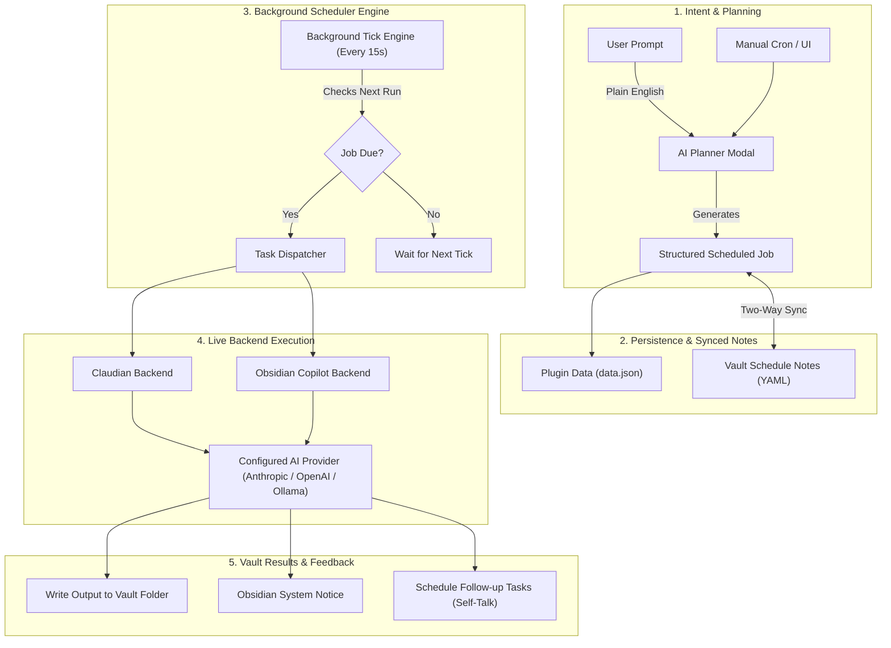

# AI Scheduler for Obsidian

<div align="center">

[](https://github.com/racstan/obsidian-ai-scheduler/releases)
[](https://obsidian.md)
[](LICENSE)
[](tsconfig.json)
[](#privacy-and-safety)

**The first and only autonomous background scheduling and proactive intelligence engine for Obsidian.**

*Turn your static second brain into an active, proactive intelligence partner that plans, reviews, executes, and synthesizes your knowledge in the background.*

[Key Superpowers](#key-superpowers) •
[Why AI Scheduler?](#why-ai-scheduler-the-missing-autonomy-layer) •
[How It Works](#how-it-works) •
[Quickstart](#quickstart--installation) •
[Schedule Types](#supported-schedule-types) •
[Nightly Reviews](#proactive-nightly-self-talk) •
[Commands](#commands) •
[FAQ](#frequently-asked-questions)

</div>

---

## Why AI Scheduler? (The Missing Autonomy Layer)

Every existing AI plugin in Obsidian is **100% reactive**. They sit quietly until you open a sidebar, highlight text, type a prompt, and wait.

**AI Scheduler is the only plugin of its kind**: it brings **true background autonomy** to Obsidian. 

Instead of treating AI as a disposable chat box, AI Scheduler gives your vault an autonomous knowledge worker that wakes up on schedule, processes your notes, uncovers connections, tracks open loops, and synthesizes daily reports—while you sleep or focus on deep work.

### Reactive Chat vs. Autonomous AI Scheduler

| Capability | Traditional Obsidian AI Plugins | ⚡ AI Scheduler |
| :--- | :--- | :--- |
| **Execution Trigger** | Manual prompt only | **Autonomous background timers, cron, & vault events** |
| **Schedule Control** | None | **5-field cron, intervals, daily, weekly, & multi-time rules** |
| **Daily Debriefs** | Manual copy-pasting | **Proactive Nightly Reviews written to your vault automatically** |
| **Planning Workflow**| Manual task creation | **Natural Language Planner turns ideas into structured jobs** |
| **Vault Integration** | Ephemeral chat sidebars | **Two-way synced Markdown notes with YAML frontmatter** |
| **Model Optimization**| One global model | **Multi-Model Matrix (lightweight for checks, flagship for reviews)** |
| **Backend Freedom**  | Proprietary lock-in | **Dual-backend support: Claudian or Obsidian Copilot** |
| **Privacy & Security**| Varies | **100% Local-first; direct to your own providers; zero telemetry** |

---

## Key Superpowers

### 🧠 1. Natural Language AI Planner
Describe an outcome in plain English, and AI Scheduler turns it into safe, recurring, structured jobs.
> *"Every evening at 10 PM, review notes I changed today, identify open loops, and write an executive summary to `AI Reviews/`."*
The planner interprets your intent, suggests optimal cron or interval cadences, and wires up the prompts and context bindings automatically.

### ⏱️ 2. Zero-Dependency Cron Engine
Need advanced cadences? AI Scheduler bundles an industrial-strength, dependency-free 5-field cron engine (`minute hour day-of-month month day-of-week`).
- Supports steps, ranges, lists, and named days (`*/15 * * * *`, `0 9 * * 1-5`).
- **DST-Safe**: Predictably handles daylight saving transitions (spring-forward gaps and fall-back duplicates).
- **Live Preview**: See human-readable plain-English explanations and the next concrete run times validated live on every keystroke.

### 📝 3. Two-Way Synced Schedule Notes
Treat your schedules as first-class citizens in your knowledge graph. When enabled, every task is mirrored as a clean Markdown note in `AI Schedules/`:
- Edit the YAML frontmatter in Obsidian → the scheduler updates automatically.
- Edit the modal UI dashboard → your schedule notes update automatically.
- Notes include a rendered schedule table with cron syntax and upcoming run times.

### 🌙 4. Proactive Nightly Reviews & Daily Previews
Configure a nightly review time and context. The plugin autonomously:
1. Gathers all Markdown files created or modified during the day.
2. Directs your configured AI backend to analyze the day's thinking.
3. Produces a rich Markdown report detailing key progress, open loops, and action items.
4. Saves the report cleanly to `<report folder>/YYYY-MM-DD-HHmmss.md`.

### ⚡ 5. Event-Driven Vault Triggers
Set jobs to trigger whenever files within a specific project folder or note change. Smart cooldown debouncing ensures the AI doesn't fire continuously while you are actively typing.

### 🎛️ 6. Multi-Model Intelligence Matrix
Don't waste expensive frontier tokens on lightweight checks:
- Set **Claude 3.5 Sonnet / GPT-4o** for complex goal planning and deep nightly reviews.
- Set **Claude 3.5 Haiku / GPT-4o-mini / Local Ollama** for frequent interval checks and task summaries.
- One-click model refresh pulls newly added models straight from your backend.

### 🛡️ 7. Resilient Background Execution & Catch-Up
- **Startup Catch-Up Window**: If Obsidian was closed when a task became due, the plugin can intelligently run due tasks on next launch (configurable window, disabled by default for safety).
- **Crash & Interrupt Recovery**: Gracefully resets interrupted tasks without double-billing recurring schedules.
- **Native Accessible Confirmations**: Built with native Obsidian confirmation modals (`ConfirmModal`) for safe, accident-free bulk actions.

---

## How It Works



---

## Quickstart & Installation

### Option 1: Via BRAT (Recommended for Instant Updates)
1. Install the **BRAT** (Beta Reviewers Auto-update Tester) plugin from Obsidian Community Plugins.
2. Open BRAT settings and click **Add Beta plugin**.
3. Paste: `https://github.com/racstan/obsidian-ai-scheduler`
4. Click **Add Plugin**, then enable **AI Scheduler** under Community Plugins.

### Option 2: Manual Installation
1. Go to the [Latest GitHub Release](https://github.com/racstan/obsidian-ai-scheduler/releases).
2. Download `main.js`, `manifest.json`, and `styles.css`.
3. Create a folder in your vault at `.obsidian/plugins/ai-scheduler/`.
4. Copy the downloaded files into that folder.
5. In Obsidian, navigate to **Settings** → **Community plugins**, reload, and toggle **AI Scheduler** ON.

---

## Prerequisites & Setup

AI Scheduler acts as the **autonomy and scheduling layer**. It drives your installed AI assistant plugins:

1. **Install an AI Backend**:
   - [Claudian](https://github.com/YishenTu/claudian) *(recommended for Claude models & deep tool integration)*, **OR**
   - [Obsidian Copilot](https://github.com/logancyang/obsidian-copilot) *(great for OpenAI, Gemini, and local LLMs)*.
2. In Obsidian **Settings** → **AI Scheduler**:
   - Choose your **Active Backend Mode** (Claudian or Copilot).
   - Configure your preferred model profiles for Planning, Tasks, and Reviews.
   - (Optional) Toggle **Keep schedule notes in my vault** to enable two-way Markdown note syncing.

---

## Supported Schedule Types

| Schedule Kind | Description | Example Syntax / Configuration |
| :--- | :--- | :--- |
| **Cron** | Full 5-field standard cron syntax | `0 9 * * 1-5` (Weekdays at 9:00 AM) |
| **Interval** | Run every *N* minutes or hours, with optional max iterations | Every `30` minutes, max `8` iterations |
| **Daily** | Fire every day at a specific wall clock time | `22:00` (Every day at 10:00 PM) |
| **Weekly** | Fire on specific days of the week at a set time | Monday, Wednesday, Friday at `09:30` |
| **Multi-Rule** | Multiple combined weekday and clock combinations | `mon,wed 09:00; fri 17:00` |
| **Once** | One-off execution at a specific future ISO timestamp | `2026-09-10T14:30:00` |
| **Vault Event** | Fire when files change in a folder, with cooldown debounce | Watch `Projects/Alpha` with 60s cooldown |

---

## Proactive Nightly Self-Talk

One of the most transformative features of AI Scheduler is the **Nightly Review**:

1. In settings, enable **Nightly Review**, pick your review time (e.g. `23:00`), and choose your target report folder (default: `AI Reviews`).
2. At the scheduled hour, AI Scheduler automatically scans all notes you created or edited that day.
3. The selected backend reads and cross-analyzes the day's notes using live vault tools.
4. A structured, timestamped review note is synthesized into your vault:
   - **Executive Summary**: High-level synthesis of what you worked on.
   - **Completed Work**: Accomplishments recorded throughout the day.
   - **Open Loops & Blockers**: Unfinished thoughts, tasks, and follow-ups.
   - **Tomorrow's Recommendations**: Proactive suggestions to hit the ground running.

---

## Commands

Open the Obsidian Command Palette (`Ctrl/Cmd + P`) and search for **AI Scheduler**:

- `AI Scheduler: Open AI Scheduler`: Open the interactive management dashboard.
- `AI Scheduler: Ask AI to plan a schedule`: Open the natural language goal planner.
- `AI Scheduler: Run AI daily preview`: Instantly generate a preview report for today's modified notes.
- `AI Scheduler: Run AI nightly review now`: Manually trigger the comprehensive nightly review on demand.
- `AI Scheduler: Enable nightly AI review`: Quickly toggle recurring nightly self-talk without opening settings.

---

## Privacy and Safety

- **No Proprietary Cloud / Zero Telemetry**: AI Scheduler contains no third-party servers, no analytics, and no telemetry.
- **Your Keys, Your Providers**: Prompts and vault files are routed strictly through your chosen backend (Claudian or Copilot) to the provider APIs you have explicitly configured.
- **Opt-In Reviews**: Automated note reading and nightly reviews are strictly opt-in.
- **Safe Quota Controls**: Tasks support bounded iterations and explicit pause controls to ensure you never run unexpected recurring API calls.

---

## Frequently Asked Questions

#### Does Obsidian need to stay open for jobs to run?
**Yes.** Obsidian plugins run inside the Obsidian desktop application environment. If Obsidian is closed, background timers pause. However, AI Scheduler includes a **Startup Catch-Up Engine**: when enabled, it checks for tasks that fell due while Obsidian was closed and executes them smoothly upon launch.

#### Can I edit tasks directly in Markdown?
**Yes!** Enable **Keep schedule notes in my vault** in settings. AI Scheduler creates a note for each task in `AI Schedules/` with YAML frontmatter. Change the schedule or prompt directly in the note, and the scheduler syncs instantly.

#### What makes this different from other Obsidian AI plugins?
Every other plugin requires you to be sitting at your keyboard typing into a chat box. AI Scheduler is the **only plugin** that orchestrates proactive, time-based, and event-based autonomous execution in Obsidian.

---

## Development & Testing

Built with TypeScript and bundled via esbuild with zero external runtime dependencies.

```bash
# Clone the repository
git clone https://github.com/racstan/obsidian-ai-scheduler.git
cd obsidian-ai-scheduler

# Install dependencies
npm install

# Run the test suite (cron parser, schedule engine, DST math)
npm test

# Run code style and Obsidian community plugin linting
npm run lint

# Typecheck source code
npm run check

# Execute smoke test against mock Obsidian environment
npm run smoke

# Build production bundle
npm run build
```

---

## License

This project is licensed under the [MIT License](LICENSE).
